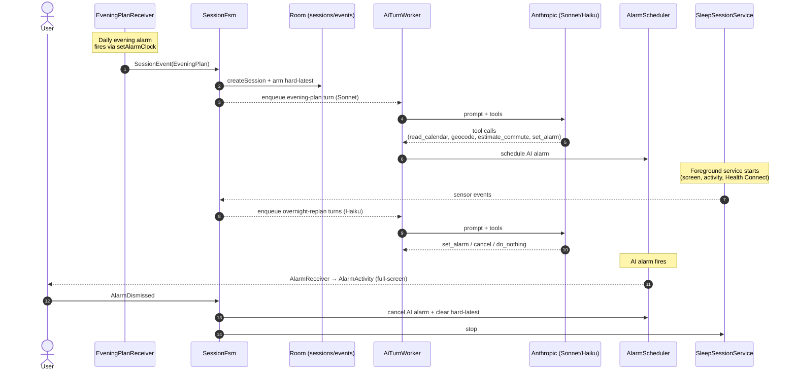
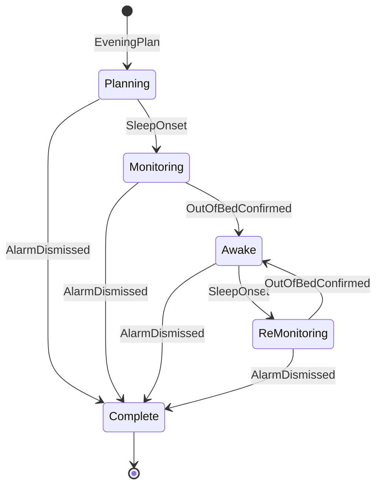
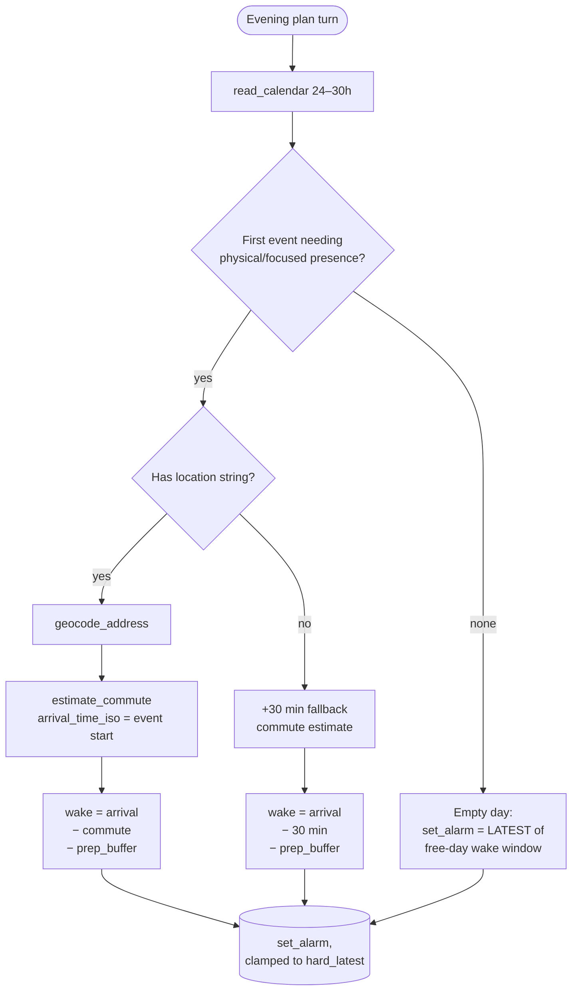
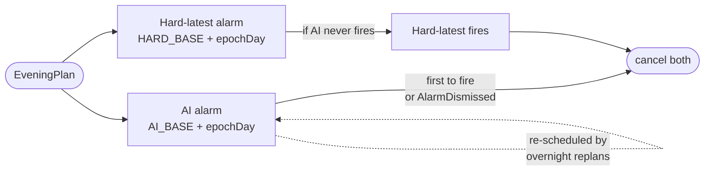

# Cron

**An Android smart alarm that picks your wake time each evening with Claude.**

Cron looks at your calendar, your current location, your travel time to your first commitment, and your sleep signals overnight, and decides what time to wake you up. The evening plan runs through Anthropic's Claude (Sonnet); short overnight re-plans run through Haiku as new sensor evidence arrives. A second "hard-latest" alarm is armed alongside the AI alarm as a safety floor — even if the AI never fires, you're guaranteed to wake by that floor.

---

## How a night looks



---

## Session state machine

Each "night" is a single `SleepSession` whose status is driven by sensor and alarm events. The transitions live in `SessionFsm.transition()`.



- **Planning** — session bootstrapped from the evening trigger; the AI is picking the initial wake time.
- **Monitoring** — user has fallen asleep; sensor monitors are emitting events to the FSM.
- **Awake** — `OutOfBedConfirmed` has fired; the foreground service is re-armed in case the user lies back down.
- **ReMonitoring** — user went back to sleep after waking; equivalent to Monitoring but tracked separately for analytics.
- **Complete** — alarm dismissed; both alarms cleared, foreground service stopped.

---

## Evening-plan decision logic

This mirrors `SystemPrompts.EVENING_PLAN`. Claude is given a structured user message containing the wake window, free-day wake window, hard-latest, commute and preparation buffers, current location, and timezone — then runs the following routine via tool calls.



Filtering rules applied at step C:
- All-day events are skipped — they're markers (birthdays, OOO), not appointments.
- Purely virtual / phone-based events are skipped unless they're the only events of the day.
- Back-to-back clusters are collapsed to the event that determines when you actually need to leave home.

---

## Overnight re-plan rules

Triggered by sensor events flowing through `SleepSessionService → SessionFsm → AiTurnWorker`. Implemented in `SystemPrompts.OVERNIGHT_REPLAN` (Haiku). Highlights:

- **Sleep onset after wake** → re-arm with a fresh `set_alarm`.
- **Mid-sleep activity < 3 min** → `do_nothing` (likely a bathroom trip).
- **Continuously out of bed for 10+ min** → `send_brief` (morning briefing notification).
- **Wake-window opportunity during light/REM** → `set_alarm` soon (within 1–2 min) to wake gently.
- **High-confidence Health Connect** (Garmin, Pixel Watch, Samsung Health) outweighs phone-only heuristics.
- **Snooze count ≥ 3** → the FSM bypasses the AI entirely and schedules the next ring at `now + 5 min` (see `SessionFsm.onSnooze`).

The AI never sets a time later than the hard latest. `set_alarm` clamps server-side.

---

## Two-alarm model



- The **AI alarm** is mutable. Each overnight replan can cancel and reschedule it any number of times.
- The **hard-latest** is armed once at session bootstrap and never moved until the session ends. Even if the AI worker crashes, the network is down, or the API key is wrong, you still wake up by the hard-latest time.
- Both alarms use stable per-day request codes (`AlarmConstants.aiRequestCode(date)` / `hardLatestRequestCode(date)`) keyed on `epochDay`, so re-scheduling overwrites in place.

---

## Project layout

```
app/src/main/java/fr/bsodium/cron/
├── alarm/        # AlarmScheduler, HardLatestScheduler, EveningPlanScheduler, AlarmConstants
├── ai/           # AnthropicClient, TurnRunner, SystemPrompts, ToolRegistry + tools (read_calendar,
│                 #   geocode, estimate_commute, set_alarm, cancel_alarm, send_brief, notify_warning,
│                 #   do_nothing)
├── calendar/     # CalendarReader (CalendarContract.Instances queries)
├── location/     # Origin location capture for commute estimation
├── receiver/     # AlarmReceiver, BootReceiver, EveningPlanReceiver, CalendarChangeReceiver,
│                 #   TimeZoneChangedReceiver
├── sensors/      # ScreenStateMonitor, ActivityRecognitionMonitor, DebugSensorEventSink
├── service/      # SleepSessionService (foreground; hosts sensor monitors overnight)
├── session/      # SessionFsm, SessionRepository, Room DAOs/entities, FSM models
├── settings/     # SettingsRepository (DataStore), SecureKeyStore (Anthropic key)
├── travel/       # RoutesClient, GeocodingClient (Google Routes API)
├── ui/           # Compose screens: HomeScreen, SettingsScreen, AlarmActivity (full-screen)
│                 #   + ViewModels and shared components
└── worker/       # AiTurnWorker, HealthConnectPollWorker (WorkManager)
```

---

## Permissions & integrations

| Permission / API | Why it's needed |
|---|---|
| `USE_EXACT_ALARM` | `AlarmManager.setAlarmClock()` for the AI alarm, hard-latest, and evening trigger |
| `USE_FULL_SCREEN_INTENT` | Lock-screen wake from `AlarmReceiver` into `AlarmActivity` |
| `RECEIVE_BOOT_COMPLETED` | Re-schedule alarms after device reboot |
| `POST_NOTIFICATIONS` | The alarm notification (and the foreground-service ongoing notification) |
| `READ_CALENDAR` | Anchor-event detection (`CalendarReader`) |
| `ACCESS_FINE_LOCATION` / `ACCESS_COARSE_LOCATION` | Origin point for commute estimation |
| `ACTIVITY_RECOGNITION` | Out-of-bed detection (Activity Transition API) |
| `FOREGROUND_SERVICE` / `FOREGROUND_SERVICE_SPECIAL_USE` | `SleepSessionService` overnight |
| `health.READ_SLEEP` | Optional: Health Connect sleep stages for higher-confidence overnight signals |
| Anthropic API | Claude (Sonnet for evening plan, Haiku for overnight re-plans) |
| Google Routes API | `estimate_commute`, `estimate_commute_multi_mode`, `geocode_address` |
| Google Play Services | Activity Recognition transitions |
| Health Connect | Sleep stage records (graceful fallback to phone-only mode after 90 min without high-confidence data) |

---

## Setup

### Prerequisites
- JDK 17
- Android Studio (recent stable)
- Min SDK 26, Target SDK 36

### Build

```bash
./gradlew assembleDebug          # debug APK
./gradlew assembleRelease        # release APK
./gradlew installDebug           # install on connected device
./gradlew testDebugUnitTest      # unit tests
./gradlew lintDebug              # lint
```

Version code and version name are derived from git tags via `git describe` — see the root `build.gradle.kts`.

### API keys

- **Anthropic** — enter your API key in-app via *AI diagnostics → Anthropic API key*. Stored in `SecureKeyStore` (Android EncryptedSharedPreferences).
- **Google Routes** — put `GOOGLE_ROUTES_API_KEY=...` in `local.properties`; injected into `BuildConfig` at build time. If empty the geocode/commute tools are omitted from the AI's tool registry and Claude will use the flat +30 min fallback.

### CI/CD

- `.github/workflows/build.yml` — debug build, lint, and unit tests on every PR/push to `main`.
- `.github/workflows/release.yml` — on `v*` tags: builds a signed release APK, renames it, and attaches it to a GitHub release.

Release flow:
```bash
git tag v1.2.3
git push origin v1.2.3
```

Store `GOOGLE_ROUTES_API_KEY` and signing secrets under *Settings → Secrets and variables → Actions* in the GitHub repo.

---

## Debug aids

Visible only in debug builds (`BuildConfig.DEBUG`):

- *Home → AI diagnostics* card:
  - **Run AI turn now** — fires a smoke-test evening-plan turn against your real calendar and prints Claude's full markdown response. Does **not** post the planning notification.
  - **Fire in 30s** — schedules a real `AlarmReceiver` broadcast 30 seconds out. Lock the phone and the full-screen alarm should wake the device.
  - **Preview UI** — opens `AlarmActivity` directly, skipping `AlarmManager`. For quick iteration on the slide-to-dismiss / slide-to-snooze UI.
- *Sensor session* card — starts/stops the foreground service and shows a rolling log of the last 20 sensor events.
- After every real evening-plan turn, a silent (`IMPORTANCE_LOW`) "Planning result" notification posts the chosen alarm time plus Claude's reason. Suppressed in release builds.

---

## License

_To be added._

## Contributing

_To be added._
